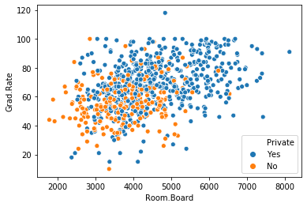
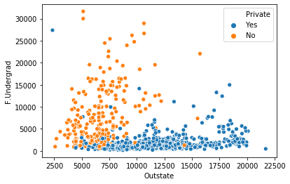
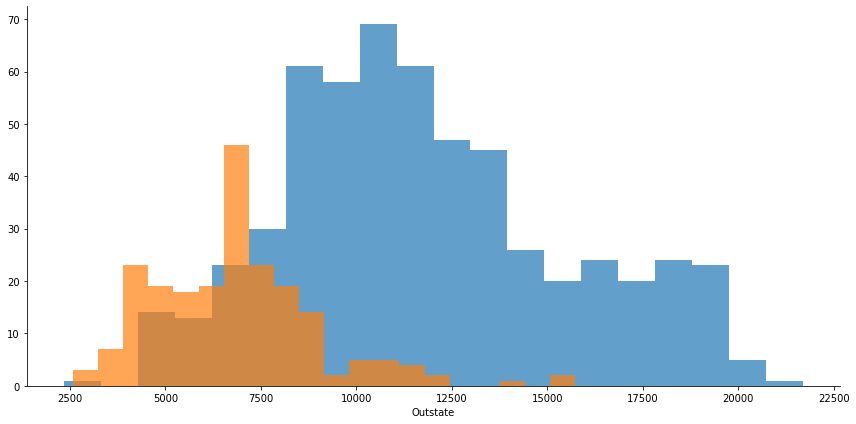
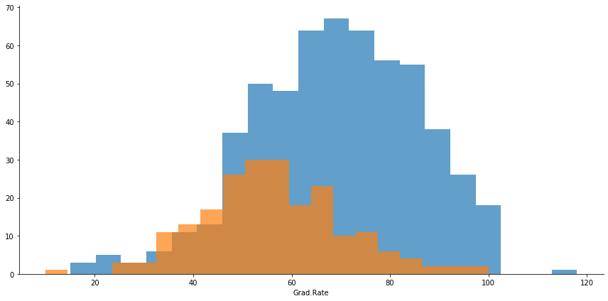

# Kmeans - Project


For this project, we will use KMeans Clustering to group Universities into two groups: Private and Public.

It is very important to note, we do have the labels for this data set, but we will NOT use them for the KMeans clustering algorithm, as this is an unsupervised learning algorithm.

When using the Kmeans algorithm in real situations, we will not have the labels. In that case, we will use the labels to try to get an idea of ​​how well the algorithm was performed, just.


## Data

We will use a data table with 777 observations on the following 18 variables.

* Private: A factor with No and Yes levels, indicating private or public university.
* Apps: Number of applications received.
* Accept: Number of applications accepted.
* Enroll: Number of students enrolled.
* Top10perc: Percentage of new students coming from the group of 10% better in high school.
* Top25perc: Percentage of new students coming from the top 25% group in high school.
* F.Undergrad: Number of full-time undergraduate students.
* P.Undergrad: Number of part-time undergraduate students.
* Outstate: Out-of-state classes.
* Room.Board: Room costs.
* Books: Estimated book costs.
* Personal: Estimated spending per person.
* PhD: Percentage of PHD's at the university.
* Terminal: Percentage of college with graduation.
* S.F.Ratio: Student / College Fee.
* perc.alumni: Percentage of alumni who donate.
* Expend: Institution expenses per student.
* Grad.Rate: Graduation rate


```python
# Import libraries to use.
import numpy as np
import pandas as pd
import seaborn as sns
import matplotlib.pyplot as plt
%matplotlib inline
```


```python
# Import data from a .csv file.
college_data = pd.read_csv('College_Data',index_col='Unnamed: 0')
```


```python
# Overview data with .head() method.
college_data.head()
```


<div>
<style scoped>
    .dataframe tbody tr th:only-of-type {
        vertical-align: middle;
    }

    .dataframe tbody tr th {
        vertical-align: top;
    }

    .dataframe thead th {
        text-align: right;
    }
</style>
<table border="1" class="dataframe">
  <thead>
    <tr style="text-align: right;">
      <th></th>
      <th>Private</th>
      <th>Apps</th>
      <th>Accept</th>
      <th>Enroll</th>
      <th>Top10perc</th>
      <th>Top25perc</th>
      <th>F.Undergrad</th>
      <th>P.Undergrad</th>
      <th>Outstate</th>
      <th>Room.Board</th>
      <th>Books</th>
      <th>Personal</th>
      <th>PhD</th>
      <th>Terminal</th>
      <th>S.F.Ratio</th>
      <th>perc.alumni</th>
      <th>Expend</th>
      <th>Grad.Rate</th>
    </tr>
  </thead>
  <tbody>
    <tr>
      <td>Abilene Christian University</td>
      <td>Yes</td>
      <td>1660</td>
      <td>1232</td>
      <td>721</td>
      <td>23</td>
      <td>52</td>
      <td>2885</td>
      <td>537</td>
      <td>7440</td>
      <td>3300</td>
      <td>450</td>
      <td>2200</td>
      <td>70</td>
      <td>78</td>
      <td>18.1</td>
      <td>12</td>
      <td>7041</td>
      <td>60</td>
    </tr>
    <tr>
      <td>Adelphi University</td>
      <td>Yes</td>
      <td>2186</td>
      <td>1924</td>
      <td>512</td>
      <td>16</td>
      <td>29</td>
      <td>2683</td>
      <td>1227</td>
      <td>12280</td>
      <td>6450</td>
      <td>750</td>
      <td>1500</td>
      <td>29</td>
      <td>30</td>
      <td>12.2</td>
      <td>16</td>
      <td>10527</td>
      <td>56</td>
    </tr>
    <tr>
      <td>Adrian College</td>
      <td>Yes</td>
      <td>1428</td>
      <td>1097</td>
      <td>336</td>
      <td>22</td>
      <td>50</td>
      <td>1036</td>
      <td>99</td>
      <td>11250</td>
      <td>3750</td>
      <td>400</td>
      <td>1165</td>
      <td>53</td>
      <td>66</td>
      <td>12.9</td>
      <td>30</td>
      <td>8735</td>
      <td>54</td>
    </tr>
    <tr>
      <td>Agnes Scott College</td>
      <td>Yes</td>
      <td>417</td>
      <td>349</td>
      <td>137</td>
      <td>60</td>
      <td>89</td>
      <td>510</td>
      <td>63</td>
      <td>12960</td>
      <td>5450</td>
      <td>450</td>
      <td>875</td>
      <td>92</td>
      <td>97</td>
      <td>7.7</td>
      <td>37</td>
      <td>19016</td>
      <td>59</td>
    </tr>
    <tr>
      <td>Alaska Pacific University</td>
      <td>Yes</td>
      <td>193</td>
      <td>146</td>
      <td>55</td>
      <td>16</td>
      <td>44</td>
      <td>249</td>
      <td>869</td>
      <td>7560</td>
      <td>4120</td>
      <td>800</td>
      <td>1500</td>
      <td>76</td>
      <td>72</td>
      <td>11.9</td>
      <td>2</td>
      <td>10922</td>
      <td>15</td>
    </tr>
  </tbody>
</table>
</div>


```python
# Overview data with .info() method.
college_data.info()
```

    <class 'pandas.core.frame.DataFrame'>
    Index: 777 entries, Abilene Christian University to York College of Pennsylvania
    Data columns (total 18 columns):
    Private        777 non-null object
    Apps           777 non-null int64
    Accept         777 non-null int64
    Enroll         777 non-null int64
    Top10perc      777 non-null int64
    Top25perc      777 non-null int64
    F.Undergrad    777 non-null int64
    P.Undergrad    777 non-null int64
    Outstate       777 non-null int64
    Room.Board     777 non-null int64
    Books          777 non-null int64
    Personal       777 non-null int64
    PhD            777 non-null int64
    Terminal       777 non-null int64
    S.F.Ratio      777 non-null float64
    perc.alumni    777 non-null int64
    Expend         777 non-null int64
    Grad.Rate      777 non-null int64
    dtypes: float64(1), int64(16), object(1)
    memory usage: 115.3+ KB
    


```python
# Overview data with .describe() method.
college_data.describe()
```


<div>
<style scoped>
    .dataframe tbody tr th:only-of-type {
        vertical-align: middle;
    }

    .dataframe tbody tr th {
        vertical-align: top;
    }

    .dataframe thead th {
        text-align: right;
    }
</style>
<table border="1" class="dataframe">
  <thead>
    <tr style="text-align: right;">
      <th></th>
      <th>Apps</th>
      <th>Accept</th>
      <th>Enroll</th>
      <th>Top10perc</th>
      <th>Top25perc</th>
      <th>F.Undergrad</th>
      <th>P.Undergrad</th>
      <th>Outstate</th>
      <th>Room.Board</th>
      <th>Books</th>
      <th>Personal</th>
      <th>PhD</th>
      <th>Terminal</th>
      <th>S.F.Ratio</th>
      <th>perc.alumni</th>
      <th>Expend</th>
      <th>Grad.Rate</th>
    </tr>
  </thead>
  <tbody>
    <tr>
      <td>count</td>
      <td>777.000000</td>
      <td>777.000000</td>
      <td>777.000000</td>
      <td>777.000000</td>
      <td>777.000000</td>
      <td>777.000000</td>
      <td>777.000000</td>
      <td>777.000000</td>
      <td>777.000000</td>
      <td>777.000000</td>
      <td>777.000000</td>
      <td>777.000000</td>
      <td>777.000000</td>
      <td>777.000000</td>
      <td>777.000000</td>
      <td>777.000000</td>
      <td>777.00000</td>
    </tr>
    <tr>
      <td>mean</td>
      <td>3001.638353</td>
      <td>2018.804376</td>
      <td>779.972973</td>
      <td>27.558559</td>
      <td>55.796654</td>
      <td>3699.907336</td>
      <td>855.298584</td>
      <td>10440.669241</td>
      <td>4357.526384</td>
      <td>549.380952</td>
      <td>1340.642214</td>
      <td>72.660232</td>
      <td>79.702703</td>
      <td>14.089704</td>
      <td>22.743887</td>
      <td>9660.171171</td>
      <td>65.46332</td>
    </tr>
    <tr>
      <td>std</td>
      <td>3870.201484</td>
      <td>2451.113971</td>
      <td>929.176190</td>
      <td>17.640364</td>
      <td>19.804778</td>
      <td>4850.420531</td>
      <td>1522.431887</td>
      <td>4023.016484</td>
      <td>1096.696416</td>
      <td>165.105360</td>
      <td>677.071454</td>
      <td>16.328155</td>
      <td>14.722359</td>
      <td>3.958349</td>
      <td>12.391801</td>
      <td>5221.768440</td>
      <td>17.17771</td>
    </tr>
    <tr>
      <td>min</td>
      <td>81.000000</td>
      <td>72.000000</td>
      <td>35.000000</td>
      <td>1.000000</td>
      <td>9.000000</td>
      <td>139.000000</td>
      <td>1.000000</td>
      <td>2340.000000</td>
      <td>1780.000000</td>
      <td>96.000000</td>
      <td>250.000000</td>
      <td>8.000000</td>
      <td>24.000000</td>
      <td>2.500000</td>
      <td>0.000000</td>
      <td>3186.000000</td>
      <td>10.00000</td>
    </tr>
    <tr>
      <td>25%</td>
      <td>776.000000</td>
      <td>604.000000</td>
      <td>242.000000</td>
      <td>15.000000</td>
      <td>41.000000</td>
      <td>992.000000</td>
      <td>95.000000</td>
      <td>7320.000000</td>
      <td>3597.000000</td>
      <td>470.000000</td>
      <td>850.000000</td>
      <td>62.000000</td>
      <td>71.000000</td>
      <td>11.500000</td>
      <td>13.000000</td>
      <td>6751.000000</td>
      <td>53.00000</td>
    </tr>
    <tr>
      <td>50%</td>
      <td>1558.000000</td>
      <td>1110.000000</td>
      <td>434.000000</td>
      <td>23.000000</td>
      <td>54.000000</td>
      <td>1707.000000</td>
      <td>353.000000</td>
      <td>9990.000000</td>
      <td>4200.000000</td>
      <td>500.000000</td>
      <td>1200.000000</td>
      <td>75.000000</td>
      <td>82.000000</td>
      <td>13.600000</td>
      <td>21.000000</td>
      <td>8377.000000</td>
      <td>65.00000</td>
    </tr>
    <tr>
      <td>75%</td>
      <td>3624.000000</td>
      <td>2424.000000</td>
      <td>902.000000</td>
      <td>35.000000</td>
      <td>69.000000</td>
      <td>4005.000000</td>
      <td>967.000000</td>
      <td>12925.000000</td>
      <td>5050.000000</td>
      <td>600.000000</td>
      <td>1700.000000</td>
      <td>85.000000</td>
      <td>92.000000</td>
      <td>16.500000</td>
      <td>31.000000</td>
      <td>10830.000000</td>
      <td>78.00000</td>
    </tr>
    <tr>
      <td>max</td>
      <td>48094.000000</td>
      <td>26330.000000</td>
      <td>6392.000000</td>
      <td>96.000000</td>
      <td>100.000000</td>
      <td>31643.000000</td>
      <td>21836.000000</td>
      <td>21700.000000</td>
      <td>8124.000000</td>
      <td>2340.000000</td>
      <td>6800.000000</td>
      <td>103.000000</td>
      <td>100.000000</td>
      <td>39.800000</td>
      <td>64.000000</td>
      <td>56233.000000</td>
      <td>118.00000</td>
    </tr>
  </tbody>
</table>
</div>


```python
# Using scatter plot to see how data is divided into two groups
sns.scatterplot(x='Room.Board', y='Grad.Rate', data=college_data, hue='Private')
```


    <matplotlib.axes._subplots.AxesSubplot at 0x195fb7e2f48>





** Crie um scatterplot de F.Undergrad versus Outstate onde os pontos são coloridos pela coluna Private. **


```python
# Using scatter plot to see how data is divided into two groups
sns.scatterplot(x='Outstate', y='F.Undergrad', data=college_data, hue='Private')
```


    <matplotlib.axes._subplots.AxesSubplot at 0x1958047a288>





```python
g = sns.FacetGrid(college_data,hue='Private',size=6,aspect=2)
g = g.map(plt.hist,'Outstate',bins=20,alpha=0.7)
```

    C:\Users\DigaoSuplementos\Anaconda3\lib\site-packages\seaborn\axisgrid.py:230: UserWarning: The `size` paramter has been renamed to `height`; please update your code.
      warnings.warn(msg, UserWarning)
    





```python
g = sns.FacetGrid(college_data,hue='Private',size=6,aspect=2)
g = g.map(plt.hist,'Grad.Rate',bins=20,alpha=0.7)
```





```python
# This step was used to see the index line and determine the right position for Grad.Rate above 100.
college_data.reset_index()[college_data.reset_index()['Grad.Rate']>100]

```


<div>
<style scoped>
    .dataframe tbody tr th:only-of-type {
        vertical-align: middle;
    }

    .dataframe tbody tr th {
        vertical-align: top;
    }

    .dataframe thead th {
        text-align: right;
    }
</style>
<table border="1" class="dataframe">
  <thead>
    <tr style="text-align: right;">
      <th></th>
      <th>index</th>
      <th>Private</th>
      <th>Apps</th>
      <th>Accept</th>
      <th>Enroll</th>
      <th>Top10perc</th>
      <th>Top25perc</th>
      <th>F.Undergrad</th>
      <th>P.Undergrad</th>
      <th>Outstate</th>
      <th>Room.Board</th>
      <th>Books</th>
      <th>Personal</th>
      <th>PhD</th>
      <th>Terminal</th>
      <th>S.F.Ratio</th>
      <th>perc.alumni</th>
      <th>Expend</th>
      <th>Grad.Rate</th>
    </tr>
  </thead>
  <tbody>
    <tr>
      <td>95</td>
      <td>Cazenovia College</td>
      <td>Yes</td>
      <td>3847</td>
      <td>3433</td>
      <td>527</td>
      <td>9</td>
      <td>35</td>
      <td>1010</td>
      <td>12</td>
      <td>9384</td>
      <td>4840</td>
      <td>600</td>
      <td>500</td>
      <td>22</td>
      <td>47</td>
      <td>14.3</td>
      <td>20</td>
      <td>7697</td>
      <td>118</td>
    </tr>
  </tbody>
</table>
</div>


```python
# After know the position of the wrong information I use the coordinates to change this value.
college_data.iloc[95,17] = 100
```


```python
# Time to use Kmeans model from sklearn library
from sklearn.cluster import KMeans

# Instance the model using as parameters n_clusters = 2 once I know that I have just two groups.
kmeans = KMeans(n_clusters=2)

# Fit the model with data unless by removing the Private column.
kmeans.fit(college_data.drop('Private', axis=1))
```


    KMeans(algorithm='auto', copy_x=True, init='k-means++', max_iter=300,
           n_clusters=2, n_init=10, n_jobs=None, precompute_distances='auto',
           random_state=None, tol=0.0001, verbose=0)


```python
# Just to see the centroid centers.
kmeans.cluster_centers_
```


    array([[1.81323468e+03, 1.28716592e+03, 4.91044843e+02, 2.53094170e+01,
            5.34708520e+01, 2.18854858e+03, 5.95458894e+02, 1.03957085e+04,
            4.31136472e+03, 5.41982063e+02, 1.28033632e+03, 7.04424514e+01,
            7.78251121e+01, 1.40997010e+01, 2.31748879e+01, 8.93204634e+03,
            6.50926756e+01],
           [1.03631389e+04, 6.55089815e+03, 2.56972222e+03, 4.14907407e+01,
            7.02037037e+01, 1.30619352e+04, 2.46486111e+03, 1.07191759e+04,
            4.64347222e+03, 5.95212963e+02, 1.71420370e+03, 8.63981481e+01,
            9.13333333e+01, 1.40277778e+01, 2.00740741e+01, 1.41705000e+04,
            6.75925926e+01]])


```python
# Just to see the label of all data.
kmeans.labels_
```


    array([0, 0, 0, 0, 0, 0, 0, 0, 0, 0, 0, 0, 0, 0, 0, 0, 0, 0, 0, 0, 1, 1,
           0, 1, 0, 0, 0, 1, 0, 0, 0, 0, 0, 0, 0, 0, 0, 0, 0, 1, 0, 0, 0, 0,
           0, 0, 0, 0, 0, 0, 0, 0, 0, 0, 0, 0, 0, 0, 0, 1, 0, 1, 0, 0, 0, 0,
           0, 0, 0, 1, 1, 0, 0, 0, 0, 0, 0, 0, 1, 1, 0, 0, 0, 0, 0, 0, 0, 1,
           0, 0, 0, 0, 0, 0, 0, 0, 0, 0, 0, 0, 0, 0, 0, 0, 0, 0, 0, 0, 0, 0,
           0, 0, 0, 0, 0, 0, 0, 0, 1, 0, 0, 0, 0, 0, 0, 0, 0, 0, 0, 0, 0, 0,
           0, 0, 0, 0, 0, 0, 0, 0, 0, 1, 0, 0, 1, 0, 0, 0, 0, 0, 0, 0, 0, 0,
           0, 0, 0, 0, 1, 0, 0, 0, 0, 0, 0, 0, 0, 0, 0, 0, 0, 0, 0, 0, 1, 0,
           1, 0, 0, 0, 0, 0, 0, 0, 0, 0, 0, 0, 0, 0, 0, 1, 0, 0, 0, 0, 0, 0,
           0, 0, 0, 0, 0, 1, 0, 0, 0, 0, 0, 0, 0, 0, 0, 0, 0, 0, 0, 0, 0, 1,
           0, 1, 1, 0, 0, 0, 0, 0, 0, 0, 0, 0, 0, 0, 0, 0, 0, 0, 0, 0, 0, 0,
           0, 0, 0, 0, 0, 0, 0, 0, 1, 0, 0, 0, 0, 0, 0, 1, 0, 0, 0, 0, 0, 0,
           0, 0, 0, 0, 0, 1, 0, 0, 0, 0, 1, 0, 0, 1, 0, 1, 0, 0, 0, 0, 1, 0,
           0, 0, 1, 0, 0, 0, 0, 0, 0, 0, 0, 0, 0, 0, 0, 0, 0, 0, 0, 0, 0, 0,
           0, 0, 0, 0, 0, 0, 0, 0, 0, 0, 0, 0, 0, 0, 0, 0, 1, 0, 0, 0, 0, 0,
           0, 0, 0, 0, 0, 0, 0, 0, 0, 0, 0, 0, 0, 0, 0, 0, 0, 0, 0, 0, 0, 0,
           0, 0, 1, 0, 0, 0, 0, 0, 0, 0, 0, 0, 0, 1, 1, 0, 0, 0, 0, 0, 0, 0,
           0, 0, 0, 0, 0, 0, 0, 0, 0, 0, 0, 0, 0, 0, 0, 0, 0, 0, 0, 0, 0, 0,
           0, 0, 0, 0, 0, 0, 0, 0, 0, 0, 0, 1, 0, 0, 0, 0, 1, 0, 0, 0, 0, 0,
           1, 1, 1, 0, 0, 0, 1, 0, 0, 0, 0, 0, 0, 0, 1, 0, 0, 0, 1, 0, 0, 0,
           0, 0, 0, 0, 0, 1, 0, 0, 0, 0, 0, 0, 0, 0, 0, 0, 0, 0, 0, 1, 0, 1,
           0, 0, 0, 0, 0, 0, 0, 0, 0, 0, 0, 0, 0, 0, 0, 0, 0, 0, 0, 0, 0, 1,
           0, 0, 0, 0, 0, 0, 0, 0, 0, 0, 0, 0, 0, 0, 0, 0, 0, 0, 0, 0, 0, 0,
           0, 0, 0, 0, 1, 0, 0, 0, 0, 0, 0, 0, 0, 0, 0, 0, 0, 0, 0, 0, 0, 0,
           0, 0, 0, 0, 0, 0, 0, 0, 1, 0, 0, 0, 0, 0, 0, 0, 0, 0, 0, 0, 0, 0,
           0, 0, 0, 0, 0, 0, 0, 0, 0, 0, 1, 1, 1, 1, 0, 0, 0, 0, 0, 0, 0, 0,
           0, 0, 0, 0, 1, 0, 0, 0, 0, 1, 0, 0, 0, 0, 0, 0, 0, 0, 0, 0, 0, 0,
           0, 0, 0, 1, 0, 0, 0, 0, 0, 0, 0, 1, 1, 1, 0, 1, 1, 1, 0, 0, 1, 0,
           0, 0, 0, 1, 1, 0, 1, 1, 1, 0, 1, 0, 1, 0, 0, 0, 0, 1, 1, 0, 1, 1,
           0, 0, 1, 0, 1, 0, 0, 0, 0, 1, 0, 1, 0, 1, 1, 0, 0, 0, 0, 1, 0, 0,
           1, 1, 1, 1, 1, 0, 0, 1, 0, 1, 0, 0, 0, 0, 0, 1, 1, 1, 0, 0, 0, 0,
           0, 1, 0, 1, 0, 0, 0, 0, 0, 1, 1, 1, 1, 0, 0, 0, 0, 0, 1, 1, 0, 0,
           0, 0, 0, 0, 1, 0, 1, 1, 0, 1, 0, 0, 0, 0, 0, 0, 1, 0, 0, 0, 0, 0,
           0, 1, 1, 0, 0, 0, 0, 0, 0, 0, 0, 0, 0, 0, 0, 0, 0, 1, 0, 0, 0, 0,
           0, 0, 0, 0, 0, 0, 0, 0, 0, 0, 0, 0, 0, 0, 0, 0, 0, 0, 0, 0, 0, 0,
           0, 0, 0, 0, 0, 1, 0])


```python
# To analyze the model, I create this function to convert Yes or No to 1 or 0 depending if the
# University is private or public.

def convert_yesno_to_01(x):
    
    cluster = 0
    
    if x.lower() == 'yes':
        
        cluster = 1
    
    return cluster        
```


```python
# Including a new column with this information.
college_data['Cluster'] = college_data['Private'].apply(convert_yesno_to_01)
```


```python
target_var = college_data['Cluster']
```


```python
# Using classification report and confusion matrix to analyze the precision of the model
from sklearn.metrics import classification_report,confusion_matrix

print(classification_report(target_var,(kmeans.labels_-1)*-1))
print('\n')
print(confusion_matrix(target_var,(kmeans.labels_-1)*-1))
```

                  precision    recall  f1-score   support
    
               0       0.69      0.35      0.46       212
               1       0.79      0.94      0.86       565
    
        accuracy                           0.78       777
       macro avg       0.74      0.64      0.66       777
    weighted avg       0.76      0.78      0.75       777
    
    
    
    [[ 74 138]
     [ 34 531]]
    
